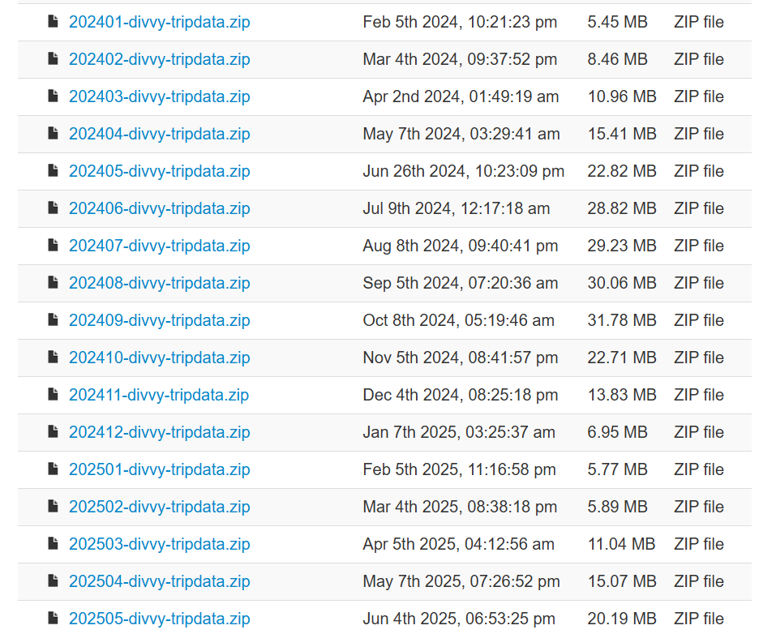
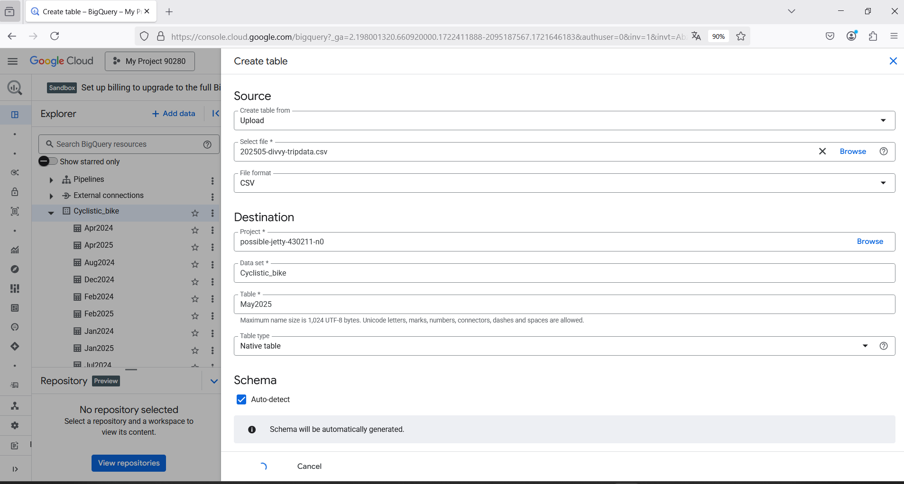
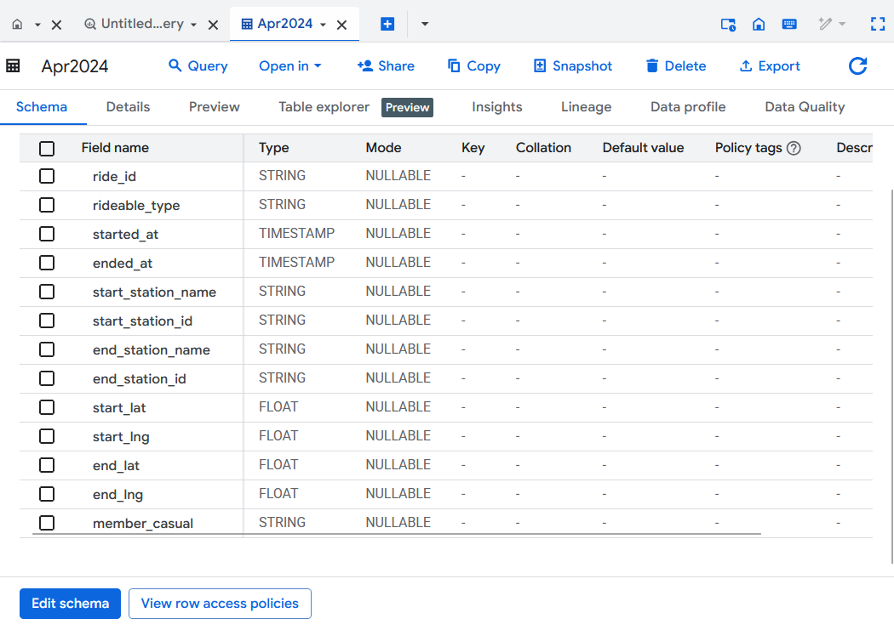
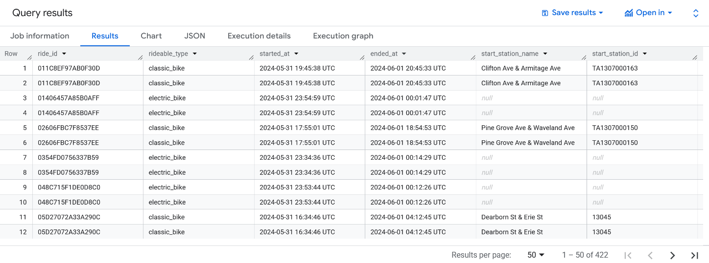
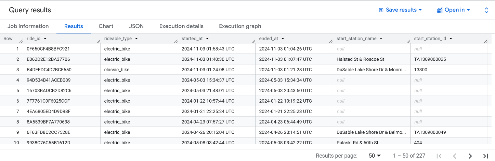
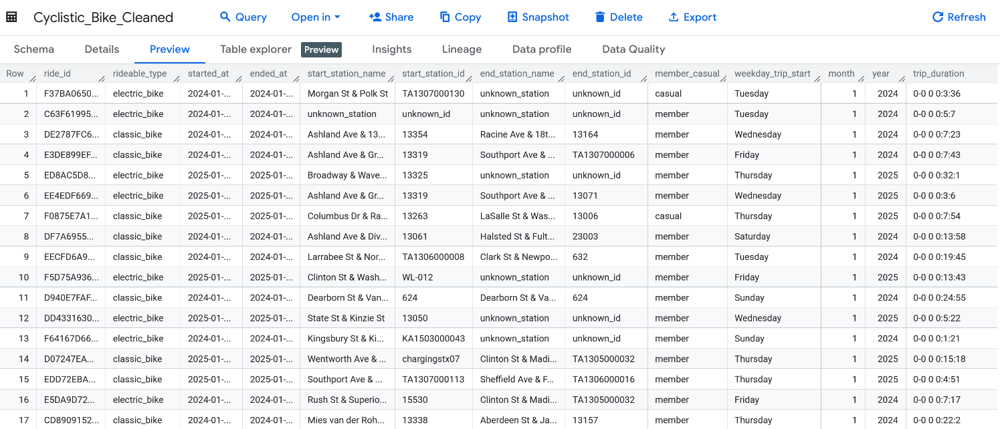
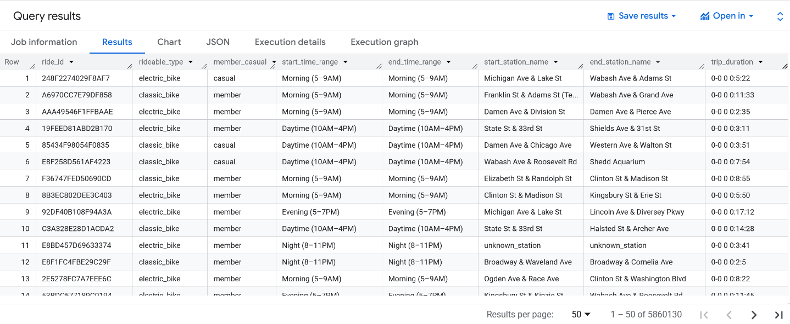
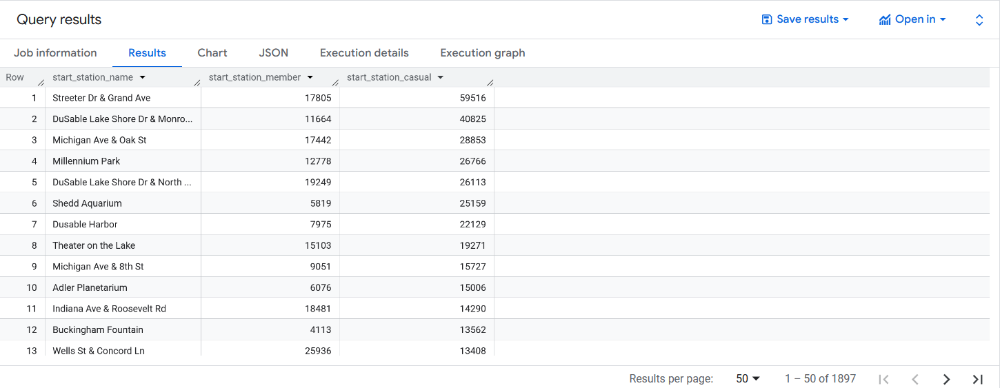
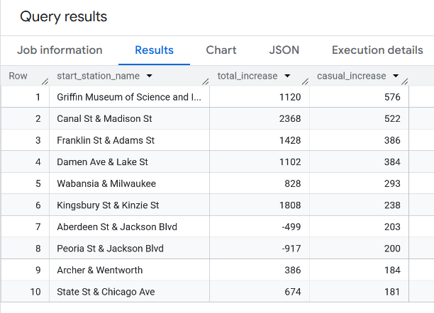
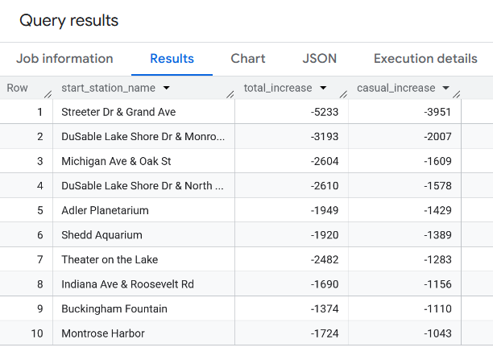

# **Cyclistic bike-share analysis** 


***SUMMARY***: 
Through a combination of intra-2024 analysis and a comparative study between January-May 2024 and January-May 2025, this case-study uncovered key insights into the differing usage patterns of casual riders and annual members of Cyclistic’s bike share program. The findings, including trip purpose, user distribution, seasonal trends, trip duration, bike type preferences, behavioural shifts by time range, and station usage concentration, offer valuable strategic insights. From these patterns, recommendations are made to support the marketing team in effectively targeting casual riders for membership conversion, ultimately driving increased revenue for the company.

This project follows the six-step data analysis process introduced in the Google Data Analytics Professional Certificate course: **Ask**, **Prepare**, **Process**, **Analyze**, **Share**, and **Act**. These steps are demonstrated across four main parts of the analysis:

- ***Introduction***: *Ask* and *Prepare* phases  
- ***Data Cleaning***: *Process* phase  
- ***Data Analysis***: *Analyze* phase  
- ***Key Findings and Recommendations***: *Share* and *Act* phases

**Main tools** used in the project are **SQL (Google Bigquery)** and **Tableau** 


# <span style="color: blue;"> **Introduction**: 
## <span style="color: red;"> Background 
- Cyclistic is a successful bike-share offering program with 5.824 bicycles locked into a network of 692 stations across Chicago. 
- The bikes can be unlocked from one station and returned to any other station in the system anytime. 
- There are flexible, customized pricing plans: sing-ride passes and full-day passes for casual users and annual memberships for Cyclistic members. 
- Cyclistic’s finance analysts have concluded that annual members are much more profitable than casual riders.
- The director of marketing believes the company’s future success depends on maximizing the number of annual memberships.

## <span style="color: red;"> Business task
The goal of this analysis is to ***understand how casual riders and annual members use Cyclistic bikes differently in order to convert casual riders into annual members***, making more profit for the company. 


## <span style="color: red;"> Data source and description
***Data source***:
The data source for this case study can be accessed at this [link](https://divvy-tripdata.s3.amazonaws.com/index.html)

***Observation***: 
The dataset comprises user reports from 2013 to May 2025. Data from 2013 to the first quarter of 2020 are recorded quarterly, except for 2013, which has only a single annual record.  From April 2020 onwards, the reports are recorded monthly.

***Case study scope***: I will focus solely on records from January 2024 to May 2025. This time frame allows for an analysis of the latest trends and enables a comparison of customer behavior throughout the year 2024, as well as between the first five months of 2025 and the same period in the previous year.




#  <span style="color: blue;">Data cleaning 

## <span style="color: red;"> Uploading
Following the extraction of ZIP files, I uploaded 17 CSV files to Google BigQuery. I utilized the *Auto-detect* option to automatically infer and define the schema based on the content of each file. 



I then verified the automatically detected schema to confirm that the data types for each column accurately reflected the underlying data.



## <span style="color: red;"> Combining tables

To build a coherent and concise table for the analysis throughout Jan 2024 to May 2025, I did the following steps: 
- using **UNION ALL** to combine the 17 tables 
- retaining only the key features relevant to the analysis
- adding two new columns of month and year to indicate the time period associated with each row
- using **TIMESTAMP_TRUNC()** to standardize the timestamps in `started_at` and `ended_at` to the second level, as I observed inconsistencies in the original data format 


``` SQL
WITH temp_table as 
(
    SELECT *, 1 AS month, 2024 AS year FROM `Cyclistic_bike.Jan2024`
    UNION ALL
    SELECT *, 2 AS month, 2024 AS year FROM `Cyclistic_bike.Feb2024`
    UNION ALL
    SELECT *, 3 AS month, 2024 AS year FROM `Cyclistic_bike.Mar2024`
    UNION ALL
    SELECT *, 4 AS month, 2024 AS year FROM `Cyclistic_bike.Apr2024`
    UNION ALL
    SELECT *, 5 AS month, 2024 AS year FROM `Cyclistic_bike.May2024`
    UNION ALL
    SELECT *, 6 AS month, 2024 AS year FROM `Cyclistic_bike.Jun2024`
    UNION ALL
    SELECT *, 7 AS month, 2024 AS year FROM `Cyclistic_bike.Jul2024`
    UNION ALL
    SELECT *, 8 AS month, 2024 AS year FROM `Cyclistic_bike.Aug2024`
    UNION ALL
    SELECT *, 9 AS month, 2024 AS year FROM `Cyclistic_bike.Sep2024`
    UNION ALL
    SELECT *, 10 AS month, 2024 AS year FROM `Cyclistic_bike.Oct2024`
    UNION ALL
    SELECT *, 11 AS month, 2024 AS year FROM `Cyclistic_bike.Nov2024`
    UNION ALL
    SELECT *, 12 AS month, 2024 AS year FROM `Cyclistic_bike.Dec2024`
    UNION ALL
    SELECT *, 1 AS month, 2025 AS year FROM `Cyclistic_bike.Jan2025`
    UNION ALL
    SELECT *, 2 AS month, 2025 AS year FROM `Cyclistic_bike.Feb2025`
    UNION ALL
    SELECT *, 3 AS month, 2025 AS year FROM `Cyclistic_bike.Mar2025`
    UNION ALL
    SELECT *, 4 AS month, 2025 AS year FROM `Cyclistic_bike.Apr2025`
    UNION ALL
    SELECT *, 5 AS month, 2025 AS year FROM `Cyclistic_bike.May2025`
)

SELECT
  ride_id,
  rideable_type,
  TIMESTAMP_TRUNC(started_at, SECOND) AS started_at,
  TIMESTAMP_TRUNC(ended_at, SECOND) AS ended_at,
  start_station_name,
  start_station_id,
  end_station_name,
  end_station_id,
  member_casual,
  month,
  year
FROM
  temp_table
```

The resulting dataset was saved as ***Combined_Cyclistic_Bike*** in Google BigQuery.


## <span style="color: red;"> Assessing data quality (Combined_Cyclistic_Bike table) 

### Check for dataset size

The data set has 7.323.089 rows and 11 features. 
***
### Check for NULL Values

~~~sql
SELECT 

  COUNTIF(ride_id IS NULL) AS missing_ride_id,
  COUNTIF(started_at IS NULL) AS missing_started_at, 
  COUNTIF(ended_at IS NULL) AS missing_ended_at, 
  COUNTIF(start_station_name IS NULL) AS missing_start_station, 
  COUNTIF(start_station_id IS NULL) AS missing_start_id, 
  COUNTIF(end_station_name IS NULL) AS missing_end_station, 
  COUNTIF(end_station_id IS NULL) AS missing_start_id, 
  COUNTIF(member_casual IS NULL) AS missing_member_type, 

FROM possible-jetty-430211-n0.Cyclistic_bike.Combined_Cyclistic_Bike 
~~~

 **RESULT**

| missing\_type           | count     |
| ----------------------- | --------- |
| missing\_ride\_id       | 0         |
| missing\_started\_at    | 0         |
| missing\_ended\_at      | 0         |
| missing\_start\_station | 1,352,624 |
| missing\_start\_id      | 1,352,624 |
| missing\_end\_station   | 1,395,030 |
| missing\_end\_id        | 1,395,030 |
| missing\_member\_type   | 0         |

 <span style="color: brown;"> **Problem: Missing values** 

The data shows that the columns `ride_id`, `started_at`, `ended_at`, and `member_type` contain no NULL values, indicating complete records in those fields. However, there are **1,352,624** records missing information in the `start_station` and `start_station_id` columns, and **1,395,030** records with missing values in the `end_station` and `end_station_id` columns.  

> **Observation** \
In a real-world scenario, it would be important to consult the data provider to clarify the reasons behind these missing values and determine whether they result from system limitations, data entry issues, or other operational factors. Understanding the root cause is essential before deciding how to address these gaps in analysis.

<span style="color: brown;"> **Solution**

 For the purpose of this analysis, those missing values can be considered as unknown_station and unknown_id. 
 ***

###  Check for duplicated values in primary key 

```sql
SELECT 
  COUNT(ride_id) as total_id,
  COUNT (DISTINCT ride_id) as distinct_id
FROM possible-jetty-430211-n0.Cyclistic_bike.Combined_Cyclistic_Bike
```
**RESULT**

| Type of count           | count     |
| ----------------------- | --------- |
| total_id                | 7323089   |
| distinct_id             | 7322878   |


> **Observation** \
The number of distinct ride ID is less than the number of total ride ID, which means there are duplicated values for this column. 
***
 <span style="color: brown;"> **Problem: Duplication** 

The dataset has duplicated values in primary key, a critical problem which need to be addressed. 
To do that, I look further into these duplicates to identify potential causes and assess their impact on the dataset. 

```sql
WITH duplicated_ride_id as
  ( 
    SELECT 
    ride_id,
    COUNT(*) as repetition
    FROM possible-jetty-430211-n0.Cyclistic_bike.Combined_Cyclistic_Bike
    GROUP BY ride_id
    HAVING repetition >1
  )

SELECT * 
FROM possible-jetty-430211-n0.Cyclistic_bike.Combined_Cyclistic_Bike
WHERE ride_id IN (SELECT ride_id FROM duplicated_ride_id) 
ORDER BY ride_id
```

**RESULT**



> **Observation** \
There are 422 duplicated `ride_id`, each appearing twice with identical values across all columns except `month`, once in May 2024 and the other in June 2024. All duplicated ride_id has `started_time` on 31/05/2024 and `ended_time` on 01/06/2024. This duplication pattern is observed only in the original files of May 2024 and June 2024. 

 <span style="color: brown;"> **Solution** 

I examined similar cases in other months, using the following query for example, and found that the records are assigned based on the `ended_at` month. 
```sql
SELECT * 
FROM possible-jetty-430211-n0.Cyclistic_bike.Combined_Cyclistic_Bike
WHERE started_at BETWEEN TIMESTAMP '2024-10-31 23:00:00' AND TIMESTAMP '2024-10-31 23:59:00' 
AND ended_at >= TIMESTAMP '2024-11-01 00:00:00'
ORDER BY started_at DESC 
```

Therefore, duplicated entries in May 2024 should be eliminated.  

***
### Check for time errors

```sql
SELECT * 
FROM possible-jetty-430211-n0.Cyclistic_bike.Combined_Cyclistic_Bike
WHERE ended_at < started_at 
```
**RESULT**


 <span style="color: brown;"> **Problem**

There are 227 entries where the `ended_at` value is earlier than the `started_at` value, indicating trips that ended before they started-an illogical scenario.

  <span style="color: brown;"> **Solution** 
  
 Ideally, more information should be gathered to understand the cause of these issues before taking action.However, given that these entries represent only 0.003% of the total dataset's entries, I consider these rows unreliable and I will exclude them from the dataset.

## <span style="color: red;"> Creating new table 
Based on the above observations and to support further analysis, I created a new table named ***Cyclistic_Bike_Cleaned*** from the Combined_Cyclistic_Bike table with the following transformations:

- using **COALESCE** to return null value in `start_station_name`, `start_station_id`, `end_station_name`, `end_station_id` with the corresponding placeholder values 'unknown_station' and 'unknown_id'
- using **WHERE** to filter rows without time errors 
- using **PARTITION** to groups ride_id into windows and using **ROW_NUMBER** to rank them from higher month value to lower ones, then filter to show only row number rank 1 to retain only the most recent record per ride ID, which address duplicate entries observed in May.
- adding a column showing weekday when each trip starts with **FORMAT_TIMESTAMP**
- caculating trip duration for each ride 

```sql
SELECT
  ride_id,
  rideable_type,
  started_at,
  ended_at,
  COALESCE(start_station_name, 'unknown_station') as start_station_name,
  COALESCE(start_station_id, 'unknown_id') as start_station_id,
  COALESCE(end_station_name, 'unknown_station') as end_station_name,
  COALESCE(end_station_id, 'unknown_id') as end_station_id,
  member_casual,
  FORMAT_TIMESTAMP('%A', started_at) as weekday_trip_start,
  month,
  year,
  ended_at - started_at as trip_duration


FROM possible-jetty-430211-n0.Cyclistic_bike.Combined_Cyclistic_Bike
WHERE started_at <= ended_at
QUALIFY row_number() OVER (PARTITION BY ride_id ORDER BY month DESC)=1
``` 

Here is a preview of table ***Cyclistic_Bike_Cleaned*** 



# <span style="color: blue;"> Data analyzing (Cyclistic_Bike_Cleaned table)

> **Data observation**: The dataset includes entries ranging from January 2024 to May 2025, covering a 17-month period. Notably, this time range contains ***two cycles*** of the months January through May (i.e., Jan-May 2024 and Jan-May 2025). Therefore, analyzing the full dataset without accounting for the duplicated months could lead to ***potential bias or misleading trends***, especially if activity patterns differ year-over-year.


## <span style="color: red;"> **Analytical strategy**

With the aforementioned observation, the analysis can be divided into 2 parts to ensure accurate and meaningful results:

1. ***Within-2024 analysis***: analyzing data from January 2024 to December 2024 to create a clear, sing-year benchmark unaffected by overlapping months 
2. ***Year-on-year Comparison***: comparing the first 5 months of 2024 and 2025 to define year-over-year similar or different patterns 

Given the goal of understanding how casual riders and annual members use Cyclistic bikes differently in order to convert casual riders into annual members, the analysis need to ***reveal trends based on subscription types*** to understand behavioral patterns and usage preferences of casual riders in comparison with annual members. Analysis' results are expected to provide insights into potential opportunities for marketing strategies.  


To achieve this objective, both within-year and year-on-year analysis will include the following components:  

- ***User share comparison***: Comparing total number of rides made by casual riders and members to understand their respective shares in total usage
- ***User activity trends***: Finding total casual_rides and member_rides by month (Jan, Feb, etc.), weekday (Mon, Tue, etc.), and time of day (morning, noon, etc.) to discover user activity trends 
- ***Bike type preference***: Evaluating the proportion of casual rides and members taken on three different rideable type 
- ***Trip Duration Analysis***: Comparing average trip duration of rides between casual riders and members to infer possible usage intent 
- ***Station popularity***: Identifying the top and bottom start/end stations for each type of riders to understand hotspots and suggest potential target areas for marketing campaigns 

## <span style="color: red;"> Within year analysis 
### User share comparison and activity trends between casual riders and members
Comparing total number of rides made by casual riders and members to understand their respective shares in total usage
#### <span style="color: purple;">  In the whole year
```sql
SELECT 
 member_casual, 
 COUNT(*) as total_number

FROM possible-jetty-430211-n0.Cyclistic_bike.Cyclistic_Bike_Cleaned
WHERE year = 2024 
GROUP BY member_casual
```
| Member Type | Total_number    |
|-------------|-----------|
| member      | 3,708,699 |
| casual      | 2,151,431 |

>***Finding***: In 2024, there are more rides made by member then casual rides
---
\
Caculating the total casual_rides and member_rides by month (Jan, Feb, etc.), weekday (Mon, Tue, etc.), time of day (morning, daytime, etc.)  to discover user activity trends 

#### <span style="color: purple;"> By month
```sql
With temp_table as
(SELECT 
  month,
  COUNT(*) as total_ride,
  COUNTIF(member_casual='casual') as casual_ride_number, 
  COUNTIF(member_casual='member') as member_ride_number

FROM possible-jetty-430211-n0.Cyclistic_bike.Cyclistic_Bike_Cleaned
WHERE year = 2024 
GROUP BY month
ORDER BY month) 

SELECT 
  month,
  total_ride,
  casual_ride_number,
  ROUND(casual_ride_number/total_ride*100,2) as casual_ride_percentage,
  member_ride_number,
  ROUND(member_ride_number/total_ride *100,2) as member_ride_percentage

FROM temp_table
ORDER BY month
```

| Month | Total Ride  | Casual Ride Number | Casual Ride Percentage (%) | Member Ride Number | Member Ride Percentage (%) |
|-------|-------------|--------------------|-----------------------------|---------------------|-----------------------------|
| 1     | 144,853     | 24,458             | 16.88                       | 120,395             | 83.12                       |
| 2     | 223,159     | 47,161             | 21.13                       | 175,998             | 78.87                       |
| 3     | 301,662     | 82,533             | 27.36                       | 219,129             | 72.64                       |
| 4     | 414,967     | 131,789            | 31.76                       | 283,178             | 68.24                       |
| 5     | 609,206     | 230,856            | 37.89                       | 378,350             | 62.11                       |
| 6     | 710,721     | 301,127            | 42.37                       | 409,594             | 57.63                       |
| 7     | 748,962     | 320,546            | 42.80                       | 428,416             | 57.20                       |
| 8     | 755,639     | 318,280            | 42.12                       | 437,359             | 57.88                       |
| 9     | 821,276     | 346,804            | 42.23                       | 474,472             | 57.77                       |
| 10    | 616,281     | 216,446            | 35.12                       | 399,835             | 64.88                       |
| 11    | 335,032     | 93,055             | 27.77                       | 241,977             | 72.23                       |
| 12    | 178,372     | 38,376             | 21.51                       | 139,996             | 78.49                       |

For visualization, I transformed the query into a long format, which is more suitable and easier to work with in Tableau.
```sql 
SELECT 
  month,
  member_casual,
  COUNT(*) as total_ride,

FROM possible-jetty-430211-n0.Cyclistic_bike.Cyclistic_Bike_Cleaned
WHERE year = 2024 
GROUP BY month,member_casual
ORDER BY month
```


> ***Findings***:   
> - Members consistently took more rides than casual users in every month across the year. 
> - Both user groups followed a similar seasonal pattern, with ride volumes increasing steadily from January, peaking during the summer months, and then declining sharply toward the end of the year.
> - Casual user rides surged significantly, increasing approximately 3.6 times from 82,533 in March to 320,546 in June. This high volume was maintained and peaked at 346804 in September, before dropping sharply to 38,376 in December.
---
#### <span style="color: purple;"> By weekday

> ***Observation***: In a year, the number of occurrences for each weekday (e.g., the number of Mondays vs. Sundays) is not the same. Therefore, using total ride counts can be misleading. To ensure fair comparison across weekdays, we use aggregated metrics such as the average number of rides  and the percentage of casual riders per weekday

```sql 
WITH
  temp_table AS (
  SELECT
    DATE(started_at),
    weekday_trip_start,
    COUNT(*) AS total_rides,
    COUNTIF(member_casual = 'casual') AS total_casual_rides
  FROM
    possible-jetty-430211-n0.Cyclistic_bike.Cyclistic_Bike_Cleaned
  WHERE
    year = 2024
  GROUP BY
    DATE(started_at),
    weekday_trip_start )

SELECT
  weekday_trip_start as weekday,
  ROUND(AVG(total_rides),2) AS average_ride_number,
  ROUND(AVG(total_casual_rides)/AVG(total_rides)*100,2) AS percentage_of_casual_riders,
FROM
  temp_table
GROUP BY
  weekday
ORDER BY
  CASE weekday
    WHEN 'Monday' THEN 1
    WHEN 'Tuesday' THEN 2
    WHEN 'Wednesday' THEN 3
    WHEN 'Thursday' THEN 4
    WHEN 'Friday' THEN 5
    WHEN 'Saturday' THEN 6
    ELSE 7
END
```
| Weekday   | Average_Ride_Number | Casual_Ride_Percentage |
|-----------|---------------------|-------------------------|
| Monday    | 14,871.00           | 32.17                  |
| Tuesday   | 15,151.98           | 28.94                  |
| Wednesday | 16,915.19           | 30.62                  |
| Thursday  | 16,070.46           | 31.72                  |
| Friday    | 16,181.90           | 37.52                  |
| Saturday  | 17,789.69           | 48.15                  |
| Sunday    | 15,137.21           | 46.99                  |

For the visualization, I focused on comparing the average number of rides between casual riders and annual members across the days of the week with the following code to make long dataset 
```sql 
WITH
  temp_table AS (
  SELECT
    DATE(started_at),
    member_casual,
    weekday_trip_start,
    COUNT(*) AS total_rides,
  FROM
    possible-jetty-430211-n0.Cyclistic_bike.Cyclistic_Bike_Cleaned
  WHERE
    year = 2024
  GROUP BY
    DATE(started_at),
    weekday_trip_start, member_casual )

SELECT
  weekday_trip_start as weekday,
  member_casual,
  AVG(total_rides) as average_ride
FROM
  temp_table
GROUP BY
  weekday, member_casual
ORDER BY
  CASE weekday
    WHEN 'Monday' THEN 1
    WHEN 'Tuesday' THEN 2
    WHEN 'Wednesday' THEN 3
    WHEN 'Thursday' THEN 4
    WHEN 'Friday' THEN 5
    WHEN 'Saturday' THEN 6
    ELSE 7
END
```


> ***Findings***: 
> - The average number of rides by members was consistently higher than that of casual users throughout the week, with a noticeably larger gap on weekdays compared to weekends.
> - The average number of rides by members remained high throughout the weekdays, peaking on Wednesday, and gradually declined toward the weekend. In contrast, casual riders showed increased activity on the weekend, with a peak on Saturday. \
 **→** These insights suggest that members are likely using the service for weekday commuting, while casual riders may primarily use it for recreational purposes at weekend.
---
#### <span style="color: purple;"> By time range 

I created a **time_range table** which categorizes each trip based on its `started_at` time and `ended_at` time. \
The time of day is segmented into five distinct ranges: 
- Morning: from 5am -9 am 
- Daytime: from 10am -4pm 
- Evening: from 5pm-7pm
- Night: from 8pm-11pm
- Late Night: from 12pm-4am

```sql
SELECT 
    ride_id, 
    rideable_type,
    member_casual, 
    CASE 
      WHEN EXTRACT(HOUR FROM started_at) BETWEEN 5 AND 9 THEN 'Morning (5-9AM)'
      WHEN EXTRACT(HOUR FROM started_at) BETWEEN 10 AND 16 THEN 'Daytime (10AM-4PM)'
      WHEN EXTRACT(HOUR FROM started_at) BETWEEN 17 AND 19 THEN 'Evening (5-7PM)'
      WHEN EXTRACT(HOUR FROM started_at) BETWEEN 20 AND 23 THEN 'Night (8-11PM)'
      ELSE 'Late Night (12-4AM)'
    END AS start_time_range,
    CASE 
      WHEN EXTRACT(HOUR FROM ended_at) BETWEEN 5 AND 9 THEN 'Morning (5-9AM)'
      WHEN EXTRACT(HOUR FROM ended_at) BETWEEN 10 AND 16 THEN 'Daytime (10AM-4PM)'
      WHEN EXTRACT(HOUR FROM ended_at) BETWEEN 17 AND 19 THEN 'Evening (5-7PM)'
      WHEN EXTRACT(HOUR FROM ended_at) BETWEEN 20 AND 23 THEN 'Night (8-11PM)'
      ELSE 'Late Night (12-4AM)'
    END AS end_time_range, 
    start_station_name, 
    end_station_name,
    trip_duration,
    year, 
    month
FROM 
    possible-jetty-430211-n0.Cyclistic_bike.Cyclistic_Bike_Cleaned
```
This table will be used for the year-on-year analysis later. For now, from this table, I filtered only entries in 2024 (with WHERE =2024 as the last line of previous code) and saved the new table as **time_range_2024**.

Here is the preview of **time_range_2024** table \


From **time_range_2024**, I calculated the total number of rides and the percentage of casual rides across the five defined time ranges. 

```sql 
WITH
    all_start as 
    (SELECT 
      start_time_range,
      COUNT(*) as total_ride_start,
      COUNTIF(member_casual='casual') as casual_ride_start
    FROM possible-jetty-430211-n0.Cyclistic_bike.time_range_2024 
    GROUP BY start_time_range),

    all_end as 
    (SELECT 
      end_time_range,
      COUNT(*) as total_ride_end,
      COUNTIF(member_casual='casual') as casual_ride_end
    FROM possible-jetty-430211-n0.Cyclistic_bike.time_range_2024 
    GROUP BY end_time_range)

SELECT 
  all_start.start_time_range as time_range,
  all_start.total_ride_start,
  all_start.casual_ride_start,
  ROUND(all_start.casual_ride_start/all_start.total_ride_start *100,2) as casual_ride_start_percentage,
  all_end.total_ride_end,
  all_end.casual_ride_end,
  ROUND(all_end.casual_ride_end/all_end.total_ride_end *100,2) as casual_ride_end_percentage
FROM all_start
FULL OUTER JOIN all_end
ON all_start.start_time_range = all_end.end_time_range

ORDER BY CASE time_range
  WHEN 'Morning (5-9AM)' THEN 1
  WHEN 'Daytime (10AM-4PM)' THEN 2
  WHEN 'Evening (5-7PM)' THEN 3
  WHEN 'Night (8-11PM)' THEN 4
  ELSE 6
END
```

| Time Range            | Total Ride Start | Casual Ride Start | Casual Ride Start percentage | Total Ride End | Casual Ride End | Casual Ride End percentage |
|-----------------------|------------------|--------------------|------------------------|----------------|------------------|----------------------|
| Morning (5-9AM)       | 1,015,129        | 246,866            | 24.32%                 | 964,903        | 223,722          | 23.19%               |
| Daytime (10AM-4PM)    | 2,562,997        | 1,021,988          | 39.87%                 | 2,474,520      | 981,412          | 39.66%               |
| Evening (5-7PM)       | 1,421,343        | 506,294            | 35.62%                 | 1,489,901      | 536,167          | 35.99%               |
| Night (8-11PM)        | 691,292          | 287,702            | 41.62%                 | 745,372        | 311,910          | 41.85%               |
| Late Night (12-4AM)   | 169,369          | 88,581             | 52.30%                 | 185,434        | 98,220           | 52.97%               |

> **Observation**: The data indicates that the proportion of casual rides remains relatively consistent between start and end times. Therefore, for simplicity and to avoid redundancy, I chose to focus on the ride start time in the analysis.

With the aforementioned observation, for Tableau visualization, I used the following query: 

```sql
SELECT 
start_time_range,
member_casual,
COUNT(*) as total_rides

FROM possible-jetty-430211-n0.Cyclistic_bike.time_range_2024
GROUP BY start_time_range, member_casual
```
 

> ***Findings***: 
>- Rides made by members generally outnumber those by casual riders, except during the late-night period (12-4 AM). The gap between member and casual rides from 5 am to 11 pm is largest in the morning (5-9 AM) with members taking approximately three times more rides and this difference gradually narrows throughout the day, reaching its smallest during night hours (8-11PM). From 12 to 4 AM, more rides made by casual riders than members. 
>- Daytime (10AM-4PM) is shared peak period for both groups.


----
#### <span style="color: purple;"> Bike type preference
Evaluating the proportion of rides taken on classic bikes vs. electric bikes by each user within the year 2024

```sql 
SELECT
  rideable_type,
  COUNT(*) AS total_rides,
  COUNTIF(member_casual= 'casual') AS casual_rides,
  ROUND(100*COUNTIF(member_casual= 'casual')/COUNT(*), 2) AS casual_rides_percentage
FROM
  `possible-jetty-430211-n0.Cyclistic_bike.Cyclistic_Bike_Cleaned`
WHERE
  year = 2024
GROUP BY
  rideable_type
```

| rideable_type     | total_rides | casual_rides | casual_rides_percentage |
|-------------------|-------------|--------------|--------------------------|
| electric_bike     | 2,980,299   | 1,091,350    | 36.62                  |
| classic_bike      | 2,735,494   | 974,866      | 35.64                  |
| electric_scooter  | 144,337     | 85,215       | 59.04                 |


> ***Finding***: 
> For both classic and electric bikes, member rides outnumber casual rides, accounting for around 65% of the total rides. In contrast, electric scooters are used more frequently by casual riders than by members.

---

#### <span style="color: purple;"> Trip Duration Analysis
Comparing trip_duration pattern to infer possible usage intent within year 2024.

##### Trip duration by subscription type 
```sql
SELECT 
    member_casual,
    ROUND(EXTRACT(HOUR FROM SUM(trip_duration)) + EXTRACT(MINUTE FROM SUM(trip_duration))/60 + EXTRACT(SECOND FROM SUM(trip_duration))/3600,2) as total_hours,
    COUNT(*) as total_rides,
    ROUND(EXTRACT(HOUR FROM AVG(trip_duration)) + EXTRACT(MINUTE FROM AVG(trip_duration))/60 + EXTRACT(SECOND FROM AVG(trip_duration))/3600,2) as average_duration_hour,
FROM `possible-jetty-430211-n0.Cyclistic_bike.Cyclistic_Bike_Cleaned` 
WHERE year = 2024
GROUP BY member_casual
```
| member_casual | total_hours | total_rides | average_duration_hour|
|---------------|-------------|------------|------------------|
| casual        | 900734.3    | 2151431    | 0.42             |
| member        | 789331.43   | 3708699    | 0.21             |

> ***Finding***: Interestingly, although casual riders took significantly fewer rides than members, their total usage hours were higher. This can be explained by the average duration per ride, as casual trips were twice as long as those of members.

##### Trip duration by start_time_range
```sql
With temp_table as
  (SELECT
  start_time_range,  
  AVG(trip_duration) as avg_trip_duration,
  AVG(CASE WHEN member_casual = 'casual' THEN trip_duration END) AS avg_casual,
  AVG(CASE WHEN member_casual = 'member' THEN trip_duration END) AS avg_member
FROM possible-jetty-430211-n0.Cyclistic_bike.time_range_2024
GROUP BY start_time_range)

SELECT
  start_time_range,
  ROUND(EXTRACT(HOUR FROM avg_trip_duration) + EXTRACT(MINUTE FROM avg_trip_duration)/60 + EXTRACT(SECOND FROM avg_trip_duration)/3600,2) as average_duration_hour,
  ROUND(EXTRACT(HOUR FROM avg_casual) + EXTRACT(MINUTE FROM avg_casual)/60 + EXTRACT(SECOND FROM avg_casual)/3600,2) as average_casual_hour,
  ROUND(EXTRACT(HOUR FROM avg_member) + EXTRACT(MINUTE FROM avg_member)/60 + EXTRACT(SECOND FROM avg_member)/3600,2) as average_member_hour,
FROM temp_table
```
| start_time_range        | average_duration_hour | average_casual_hour | average_member_hour |
|-------------------------|------------------------|----------------------|----------------------|
| Morning (5-9AM)         | 0.23                   | 0.33                 | 0.20                 |
| Daytime (10AM-4PM)      | 0.31                   | 0.46                 | 0.22                 |
| Evening (5-7PM)         | 0.28                   | 0.40                 | 0.22                 |
| Night (8-11PM)          | 0.28                   | 0.38                 | 0.21                 |
| Late Night (12-4AM)     | 0.33                   | 0.45                 | 0.21                 |

 

> ***Finding***: Casual riders consistently take longer rides than members across all time ranges. The most notable gap occurs during the daytime (10AM-4PM) and late night (12-4AM).


##### Trip duration by rideable_type


```sql 
With temp_table as 
(SELECT 
  rideable_type,
  AVG(trip_duration) as avg_trip_duration,
  AVG(CASE WHEN member_casual = 'casual' THEN trip_duration END) AS avg_casual,
  AVG(CASE WHEN member_casual = 'member' THEN trip_duration END) AS avg_member
FROM `possible-jetty-430211-n0.Cyclistic_bike.Cyclistic_Bike_Cleaned` 
WHERE year = 2024
GROUP BY rideable_type)

SELECT
  rideable_type,
  ROUND(EXTRACT(HOUR FROM avg_trip_duration) + EXTRACT(MINUTE FROM avg_trip_duration)/60 + EXTRACT(SECOND FROM avg_trip_duration)/3600,2) as average_duration_hour,
  ROUND(EXTRACT(HOUR FROM avg_casual) + EXTRACT(MINUTE FROM avg_casual)/60 + EXTRACT(SECOND FROM avg_casual)/3600,2) as average_casual_hour,
  ROUND(EXTRACT(HOUR FROM avg_member) + EXTRACT(MINUTE FROM avg_member)/60 + EXTRACT(SECOND FROM avg_member)/3600,2) as average_member_hour,
FROM temp_table
```
| rideable_type     | average_duration_hour | average_casual_hour | average_member_hour |
|-------------------|------------------------|----------------------|----------------------|
| electric_scooter  | 0.17                   | 0.20                 | 0.14                 |
| electric_bike     | 0.21                   | 0.24                 | 0.19                 |
| classic_bike      | 0.38                   | 0.64                 | 0.24                 |


> ***Finding***: A significant gap can be observed in the average duration of classic bike rides between casual riders and members. While the average duration for casual riders was 0.64 hours, that for members was only 0.24 hours. For other rideable types, such as electric bikes and electric scooters, casual riders also had slightly higher average durations, but the difference was much smaller.

#### <span style="color: purple;">  Station popularity 
Identifying the top start stations for each type of riders to understand hotspots and suggest potential target areas for marketing campaigns

```sql
SELECT  
   start_station_name,
   COUNTIF(member_casual="member") as start_station_member,
   COUNTIF(member_casual="casual") as start_station_casual,
FROM `possible-jetty-430211-n0.Cyclistic_bike.Cyclistic_Bike_Cleaned` 
WHERE start_station_name != 'unknown_station'
GROUP BY start_station_name
ORDER BY start_station_casual DESC
```



>***Finding***: There were 1,897 different start stations. The following chart displays the top 10 most popular start stations for members and casual riders, shown separately: 
>- Streeter Dr & Grand Ave was the most popular station for casual riders, with 59,516 rides departing from this location. 
>- The top station for member riders was Kingsbury St & Kinzie St with 40,363 rides.
>- Notably, there were no overlapping stations in the top 10 lists for members and casual riders. This clear distinction in station preferences suggests that marketing efforts could be tailored more effectively-by focusing on the top 10 stations for each group, campaigns can be specialized to better target either casual or member riders.
 


I calculated the cumulative percentage of both casual and member rides with respect to their start stations.
```sql
 WITH cumulative_table AS 
  (SELECT
    start_station_name,
    casual_rides,
    SUM(casual_rides) OVER (ORDER BY casual_rides DESC) AS cumulative_rides,
    SUM(casual_rides) OVER () AS total_rides,
    ROUND(100*SUM(casual_rides) OVER (ORDER BY casual_rides DESC)/SUM(casual_rides) OVER (),2) as cumulative_percentage
  FROM (
    SELECT
      start_station_name,
      COUNTIF(member_casual="casual") AS casual_rides,
    FROM
      possible-jetty-430211-n0.Cyclistic_bike.Cyclistic_Bike_Cleaned
    WHERE
      start_station_name != 'unknown_station'
    GROUP BY
      start_station_name))

SELECT 
    start_station_name,
    casual_rides,
    cumulative_rides,
    cumulative_percentage,
    RANK() OVER (ORDER BY casual_rides DESC) as rank
FROM cumulative_table 
ORDER BY casual_rides DESC
  ```

This query allows me to identify how many stations account for a specific percentage of casual rides by applying a filter at the end: **WHERE cumulative_percentage <= [value]** \. The rank field ranks stations in descending order of total casual rides, meaning that a rank of 1 to 10 represents top 10 most popular stations for casual riders. 


I applied the same query to gain insights for member rides by modifying the aggregation to **COUNTIF(member_casual = "member") AS member_rides**. 


>***Findings***:
>- The top 10 most popular stations for casual rides account for 13.38% of total rides. Meanwhile, 50,2% of rides originate from the top 99 stations, and 80,08% from the top 250 stations.
>- The top 10 most popular stations for member rides account for 7.67% of total rides. 50% of rides originate from the top 114 stations, and 80% from the top 254 stations.

### <span style="color: red;"> ***Main insights from within-2024 analysis***
- Both groups follow a clear seasonal trend, with casual rider demand rising sharply in summer (June to September), peaking in September before dropping significantly.

- Members ride more frequently on weekdays, especially during morning hours (5-9 AM) and daytime (10 AM-4 PM), suggesting commuting usage. Meanwhile, casual riders are less active on weekdays and most active on weekends during daytime hours, indicating a preference for leisure-oriented trips.However, during late-night hours (12-4 AM), casual riders make more trips than members. 

- Casual riders use electric scooters more often than members.

- Casual riders consistently take longer trips than members, especially during daytime and late-night periods. The most notable gap in ride duration is observed with classic bikes.

- For both rider groups, a large share of total rides originates from a relatively small number of stations. The analysis identifies the top 10 most popular stations, as well as the list of stations from which 50% and 80% of total rides begin for each group.

## <span style="color: red;"> Year-on-year analysis 
>  This section will focus on detecting trend changes between January-May 2024 and January-May 2025

### User share comparison and activity trends between casual riders and members

#### <span style="color: purple;"> Total rides (Jan-May 2024 vs. Jan-May 2025)

```sql
SELECT 
 member_casual, 
 year,
 COUNT(*) AS total_rides

FROM possible-jetty-430211-n0.Cyclistic_bike.Cyclistic_Bike_Cleaned
WHERE month >= 1 AND month <= 5
GROUP BY member_casual, year
```


>***Finding***:  Although the total number of rides dropped by 144,158 for members and 87,168 for casual riders, the shares of casual and member rides remained nearly unchanged between January and May in 2024 and 2025.

#### <span style="color: purple;">By months (Jan-May 2024 vs. Jan-May 2025)
```sql 
SELECT 
  year,
  month,
  member_casual, 
  COUNT(*) as total_ride,

FROM possible-jetty-430211-n0.Cyclistic_bike.Cyclistic_Bike_Cleaned
WHERE month >= 1 AND month <= 5
GROUP BY member_casual, year, month
ORDER BY year, month
```


>***Findings***:  
>- In general, the number of both casual and member rides declined from 2024 to 2025, with the exception of casual rides in March 2025, which slightly surpassed those of March 2024. 
>- For casual rides, the most significant decline occurred in May 2025, with a drop of 48,219 rides compared to May 2024. For member rides, the largest decrease was in February 2025, with 51,872 fewer rides than in February 2024.


#### <span style="color: purple;"> By weekday (Jan-May 2024 vs. Jan-May 2025)
```sql
WITH
  temp_table AS (
  SELECT
    DATE(started_at),
    weekday_trip_start,
    member_casual,
    year,
    COUNT(*) AS total_rides,
    
  FROM
    possible-jetty-430211-n0.Cyclistic_bike.Cyclistic_Bike_Cleaned
  WHERE
    month >= 1 AND month <= 5
  GROUP BY
    DATE(started_at),
    weekday_trip_start,
    member_casual,
    year)

SELECT
  weekday_trip_start as weekday,
  year,
  member_casual,
  ROUND(AVG(total_rides),2) AS average_ride_number,
FROM
  temp_table
GROUP BY
  weekday, member_casual, year
ORDER BY
  CASE weekday
    WHEN 'Monday' THEN 1
    WHEN 'Tuesday' THEN 2
    WHEN 'Wednesday' THEN 3
    WHEN 'Thursday' THEN 4
    WHEN 'Friday' THEN 5
    WHEN 'Saturday' THEN 6
    ELSE 7
END
```


>***Findings***:  Between Jan-May 2024 to the same period in 2025:  
>- There is a noticeable decline in the average number of rides for both casual and member riders on several days: approximately 29% for casual riders and 22% for members on Wednesdays, 22% for casual riders and 13% for members on Saturdays, and 29% for casual riders and 19% for members on Sundays.
>- The weekday with the lowest average number of casual rides shifted from Tuesday in 2024 to Wednesdays in 2025. Meanwhile, the highest average number of member rides occurred on Thursday in 2025, compared to Wednesdays in 2024.
>- There is a slight increase in the average number of casual rides on Fridays, rising from 3,314 in 2024 to 3,495 in 2025.


#### <span style="color: purple;"> By time range (Jan-May 2024 vs. Jan-May 2025)
```sql 
SELECT
  year,
  start_time_range,
  member_casual,
  COUNT(*) as total_rides

FROM possible-jetty-430211-n0.Cyclistic_bike.time_range
WHERE month >= 1 AND month <= 5
GROUP BY 
  year, 
  start_time_range, 
  member_casual
```


>***Findings***: Comparing between from January-May 2024 to the same period in 2025
>- There is an overall decline in both casual and member rides across all time ranges, except for casual rides during the late night (12-4AM), which saw a slight increase from 17,988 to 18,938 rides (a 5.3% rise).
>- The decline is generally more pronounced for casual riders than for members across most time slots.
>- Daytime consistently sees the highest number of rides for both user types, but experienced the most significant numerical drops in both groups (around 17% decrease for casual rides and 13% decrease for member rides).
>- Late night is consistently the least used time slot.

#### <span style="color: purple;"> Bike type preference (Jan-May 2024 vs. Jan-May 2025)
```sql
SELECT
  rideable_type,
  year,
  member_casual,
  COUNT(*) AS total_rides,
FROM
  `possible-jetty-430211-n0.Cyclistic_bike.Cyclistic_Bike_Cleaned`
WHERE
  month <=5 AND month >=1 
GROUP BY
  rideable_type, 
  year, 
  member_casual
```


>***Findings***: 
>- From January to May in both 2024 and 2025, only two of the three available bike types were used: classic bikes and electric bikes, with scooters absent from usage during both periods. 
>- While the total number of classic bike rides decreased by 322,372 rides, electric bikes were used more frequently in January-May 2025 with 924,406 rides, compared to 833,360 rides during the same period in 2024. 
>- Although the percentage of casual rides out of total rides remained relatively stable-from 30.51% in 2024 to 29.38% in 2025-there was a shift in the type of bikes used. Casual rides on classic bikes decreased by 4.46%, while casual rides on electric bikes increased by 3.33%, suggesting a potential shift in user preference toward electric bikes.

#### <span style="color: purple;"> Average trip duration
```sql
SELECT 
    year,
    member_casual,
    rideable_type,
    ROUND(EXTRACT(HOUR FROM AVG(trip_duration)) + EXTRACT(MINUTE FROM AVG(trip_duration))/60 + EXTRACT(SECOND FROM AVG(trip_duration))/3600,2) as average_duration_hour,
FROM `possible-jetty-430211-n0.Cyclistic_bike.Cyclistic_Bike_Cleaned` 
WHERE month>=1 AND month<=5
GROUP BY member_casual, rideable_type, year
```


> ***Findings***: 
>- Average trip durations decreased slightly for both user types, with casual users still riding significantly longer than members.
>- The trends in average trip duration by rideable type remained consistent between Jan-May 2024 and Jan-May 2025. For both years, the average duration of casual rides on classic bikes was approximately three times longer than that of member rides. 

#### <span style="color: purple;"> Station popularity 

```sql 
WITH
  year_counts AS (
  SELECT
    start_station_name,
    COUNTIF(year = 2024) AS total_2024,
    COUNTIF(year = 2025) AS total_2025,
    COUNTIF(year = 2024
      AND member_casual = 'casual') AS casual_2024,
    COUNTIF(year = 2025
      AND member_casual = 'casual') AS casual_2025,
  FROM
    possible-jetty-430211-n0.Cyclistic_bike.Cyclistic_Bike_Cleaned
  WHERE
    start_station_name != 'unknown_station'
    AND month >=1
    AND month <=5
  GROUP BY
    start_station_name )
SELECT
  start_station_name,
  (total_2025 - total_2024) AS total_increase,
  (casual_2025 - casual_2024) AS casual_increase
FROM
  year_counts
```

I identified the top 10 stations with the highest increase in the number of casual rides between January-May 2024 and Jan-May 2025 by adding the following to the end of the query:

``` sql 
ORDER BY casual_increase DESC
LIMIT 10
```




Similarly, to find the top 10 stations with the largest drop in the number of casual rides during the same period, I used:
``` sql 
ORDER BY casual_increase 
LIMIT 10
```


### <span style="color: red;"> ***Main insights from year-on-year analysis between Jan-May 2024 and Jan-May 2025***

- Between January and May 2024 and the same period in 2025, Cyclistic experienced a general decline in ridership across both member and casual users. Despite this drop, the proportion of casual to member rides remained relatively stable, indicating consistent user group behavior over time.

- Monthly trends show a general decline across the board, except for casual rides in March 2025, which slightly exceeded March 2024 levels. The most significant drop in casual rides occurred in May 2025 (down by 48,219 rides), while the largest decline in member ride was seen in February 2025 (down by 51,872 rides).

- Weekday usage patterns shifted notably. Both casual and member rides saw significant declines on Wednesdays, Saturdays, and Sundays. The least active day for casual users shifted from Tuesday in 2024 to Wednesday in 2025. Interestingly, casual rides slightly increased on Fridays.

- Time-of-day analysis revealed a consistent decline in usage across all periods, except for the late night window (12-4 AM), where casual rides increased by 5.3%. Daytime remained the busiest period for both user types but also experienced the steepest numerical drop. Late night continued to be the least used time slot overall.

- In terms of bike preferences, only classic and electric bikes were used during both periods, with no scooter rides recorded. Casual users showed a slight shift in preference from clasic bikes to electric bikes.

- Average trip durations decreased slightly for both user types, with casual users still riding significantly longer than members.

- At the station level, analysis identified the top 10 stations with the largest increases and decreases in casual rides between January-May 2024 and the same period in 2025. 


 # <span style="color: blue;"> Key Findings and Recommendations

## <span style="color: red;">  Key Findings: Differences in Usage Patterns between Casual and Annual Bike Share Users 

With the goal of ***understanding how casual riders and annual members use Cyclistic bikes differently in order to identify opportunities to convert casual riders into annual members***, the combination of within-2024 usage patterns and year-on-year comparisons (Jan-May 2024 vs. Jan-May 2025) reveals the following key insights:

- ***Trip Purpose***: Member rides are more concentrated on weekdays, especially during morning (5-9 AM) and daytime hours (10 AM-4 PM), aligning with commute patterns. In contrast, casual riders are most active on weekends and during the daytime, indicating recreational or social usage. 

- ***Consistent User Split***: Despite a general decline in the total number of rides from Jan-May 2024 to Jan-May 2025, the ratio between casual and member rides remained stable. This indicates clear segmentation in rider behavior that can be strategically targeted.

- ***Seasonal Behavior***: Casual rides' demand is highly seasonal, surging between June and September, peaking in September. This suggests casual riders are more influenced by weather and tourism, highlighting an opportunity to promote memberships during peak seasons.

- ***Bike Preferences***: Casual riders show a growing preference for electric bikes over classic bikes, while members maintain more consistent use. Casual users also use electric scooters more frequently, indicating an openness to alternative mobility options.

- ***Trip Duration***: Casual riders consistently take longer trips than members across all time periods, especially during the daytime and late night. The largest duration gaps appear when using classic bikes, which may reflect different ride intentions.

- ***Behavioral Shifts***: Within 2024, casual rides were more likely than member rides to occur during late-night hours (12-4 AM). For year-on-year analysis, casual usage slightly increased on Fridays, and late-night usage rose by 5.3%, indicating emerging patterns that could be leveraged for targeted campaigns (e.g., weekend passes, night-ride promotions).

- ***Station Concentration***: Both rider types tend to start their trips from distinct but concentrated sets of key stations. The analysis separately identified the most popular starting points for casual and member riders, as well as the top 10 stations with the largest increases and top 10 with the largest decreases in casual rides between January-May 2024 and the same period in 2025. These insights offer strategic locations for targeted marketing and membership conversion efforts.

## <span style="color: red;">  Recommendations 
With the aforementioned findings, some recommendations can be made for the marketing team to convert casual riders into annual members: 

- **Launch seasonal membership discounts or limited-time trial offers during high-demand months (June–September)** to capture casual riders when ridership peaks. These promotions can encourage trial and conversion during the period when casual usage is at its highest.

- **Highlight commuting benefits in conversion campaigns**, as members tend to use Cyclistic bikes for weekday commutes. Emphasize cost savings and environmental benefits to appeal to regular riders. Consider offering commuter-oriented incentives such as guaranteed bike availability during peak hours and referral bonuses for workplace sign-ups.

- **Position membership as a lifestyle upgrade** to appeal to casual riders who primarily use the service for leisure or social activities. Campaigns can showcase the benefits of membership for weekend rides, family outings, or exploring the city. For example, promote discounted weekend rides or special member-only access to scenic routes and events.

- **Introduce Night and Weekend Membership Perks** As casual rider behavior shows increased activity during late-night hours and from Friday to Sunday, Cyclistic can enhance membership subscriptions with night and weekend-specific perks to better appeal to this segment and encourage conversion.

- **Develop electric bike-focused membership campaigns** to target casual riders who prefer electric bikes and scooters. Offer added incentives such as free e-bike upgrades, bonus ride minutes, or e-bike-specific membership tiers to convert this growing segment.

- ***Use Station Data for Targeted Outreach***: Run geo-targeted ads, place station-based signage, and offer QR code discounts at stations with a high volume of casual rides-especially those showing an upward trend in usage.


